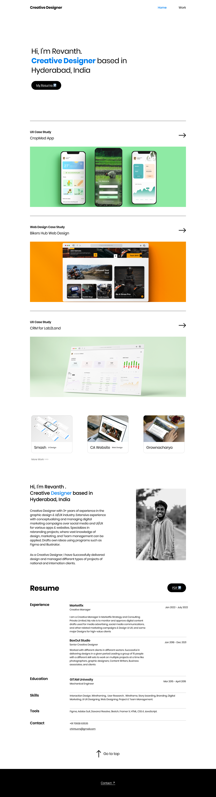

# UX/UI Portfolio

[Figma](<https://www.figma.com/file/lLHfJgOuOvHpIOIaiFy3l6/My-Portfolio---Revanth-(Community)?node-id=0%3A1&t=ho9OdIWMjpvSAXn0-0>)

## Assets

- Font-family: Poppins
- Base-typo: 24px
- Heading: 48px
- Content: 20px
- Description: 16px
- Border: 1px
- Strong: #007FEF
- Main: #000000
- Border-radius: 15px
- Border-color: grey
- Button-radius: 60px
- Padding-l-r: 200px
